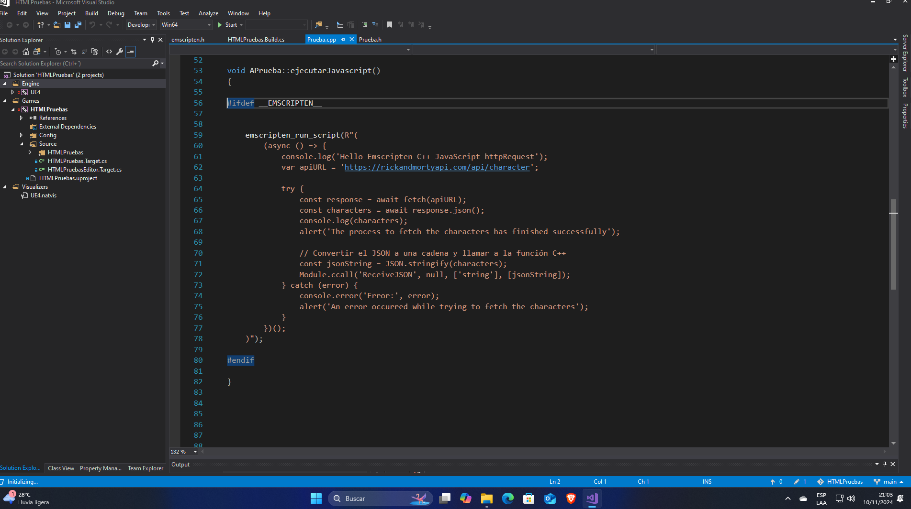
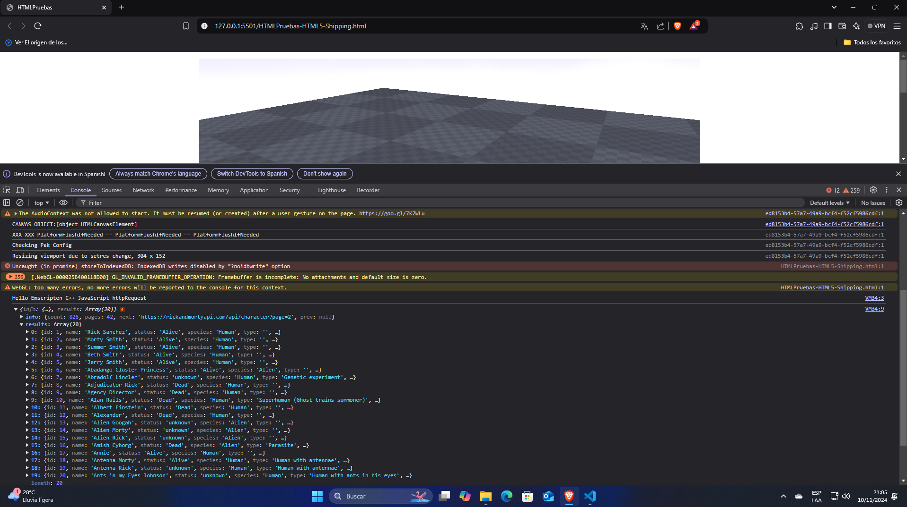

## un proyecto de Unreal Engine 4.23 donde llamo a código javascript dentro de C++ usando emscripten para que se ejecute en la web.

Para ver el funcionamiento tienes que abrir el proyecto con UE 4.23 y exportarlo en HTML.

